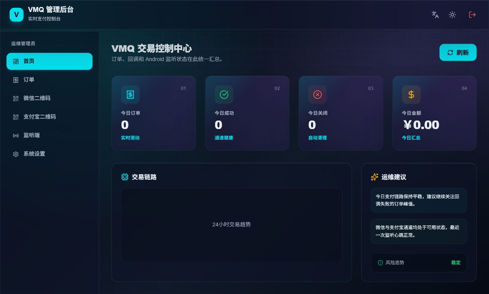
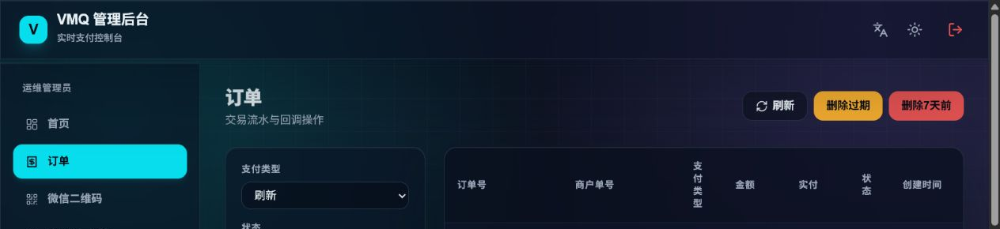
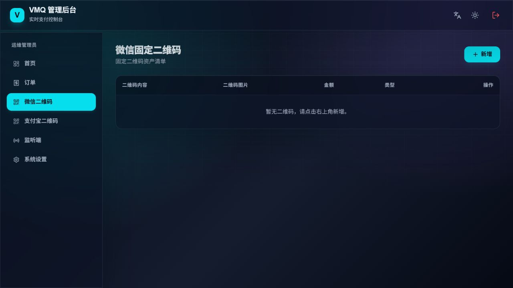
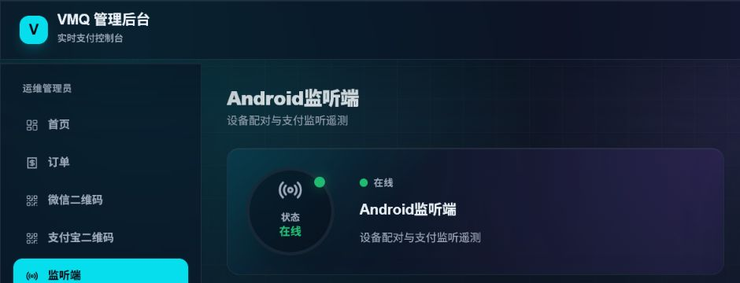

# VMQ Suite

VMQ Suite 是一套个人收款通知监听方案，包含 Spring Boot 服务端、Next.js 管理端和 Android 通知监听端。Android 设备识别微信或支付宝到账通知后，将金额上报给服务端；服务端匹配待支付订单并回调业务系统。

> 本项目仅适合学习、测试和个人自用，不是微信支付或支付宝官方支付接口。使用者应自行确认当地法律、平台规则、隐私义务和资金风险；生产或商业场景优先使用官方支付产品。

## 组成

| 模块 | 目录 | 技术栈 | 作用 |
| --- | --- | --- | --- |
| VMQ API | `apps/vmq-api` | Java 21, Spring Boot 3.5.16, PostgreSQL 16 | 订单、二维码、心跳、到账匹配和回调 |
| VMQ Web | `apps/vmq-web` | Next.js 16, React 19, TypeScript | 管理后台和收银页 |
| VMQ Android | `apps/vmq-android` | Java 17, Android SDK 35 | 通知监听、金额识别和可靠上报 |

```text
微信/支付宝到账通知
        -> Android 监听端
        -> VMQ API /appPush
        -> 待支付订单匹配
        -> 商户 notifyUrl 回调
```

## 界面预览

以下截图来自 VMQ Suite 的自部署示例环境，用于展示管理后台的核心页面。截图已避开系统设置、通讯密钥、配置二维码和订单明细等敏感内容；部署时请替换为你自己的地址和凭据。

### 交易控制台



### 订单管理



### 微信固定二维码



### Android 监听端



## 快速启动

需要 Docker 和 Docker Compose v2。

```bash
cp .env.example .env
```

必须先修改 `.env` 中的 `VMQ_ADMIN_PASSWORD` 和 `POSTGRES_PASSWORD`，然后启动：

```bash
docker compose up -d --build
```

管理端地址：`http://localhost:8080/vmq/`

查看状态和日志：

```bash
docker compose ps
docker compose logs -f vmq-api vmq-web
```

停止服务但保留数据库：

```bash
docker compose down
```

## 本地开发

服务端需要 JDK 21、Maven 3.9+ 和 PostgreSQL 16：

```bash
cd apps/vmq-api
mvn test
mvn spring-boot:run
```

Web 端需要 Node.js 22+ 和 pnpm：

```bash
pnpm install
pnpm dev:web
```

默认 Web 地址是 `http://localhost:3080/vmq/`，开发模式会将 `/vmq-api/*` 转发到本机 `50126` 端口。

Android 端需要 JDK 17 和 Android SDK 35：

```bash
cd apps/vmq-android
./gradlew testDebugUnitTest
./gradlew assembleDebug
```

Windows 使用 `gradlew.bat`。调试 APK 位于 `apps/vmq-android/app/build/outputs/apk/debug/`。

仓库不提供发布签名。发布 APK 前，请在本机或 CI 的安全存储中配置自己的 release keystore，禁止将私钥提交到 Git。

## 接入流程

1. 登录管理端并设置通讯密钥、超时时间和收款二维码。
2. 在 Android App 中扫描管理端生成的配置二维码，授予通知使用权。
3. 商户系统调用 `/createOrder` 创建订单。
4. 用户付款后，Android 端通过 `/appPush` 上报到账金额。
5. 服务端按支付类型与实际金额匹配订单，并调用 `notifyUrl`。
6. 商户回调处理成功后返回纯文本 `success`。

新接入推荐使用 HMAC-SHA256 签名和公网 HTTPS 回调。旧 MD5 签名仅用于兼容历史客户端。

## 文档

- [部署指南](docs/vmq-suite/DEPLOYMENT.md)
- [接口对接指南](docs/vmq-suite/INTEGRATION_GUIDE.md)
- [接口契约](docs/vmq-suite/INTERFACE_SPEC.md)
- [安全与代码审查报告](docs/vmq-suite/SECURITY_REVIEW_2026-07-15.md)
- [问题修复清单](docs/vmq-suite/REMEDIATION_CHECKLIST.md)
- [Android 使用与排障](docs/vmq-suite/ANDROID.md)
- [数据库迁移](docs/vmq-suite/DATABASE_MIGRATION.md)
- [运维与安全](docs/vmq-suite/OPERATIONS.md)
- [安全策略](SECURITY.md)
- [贡献指南](CONTRIBUTING.md)

## 开源说明

本仓库保留 VMQ 原项目的 MIT 许可与版权声明，详见 [LICENSE](LICENSE) 和 [NOTICE](NOTICE)。第三方依赖仍分别受其自身许可证约束。
